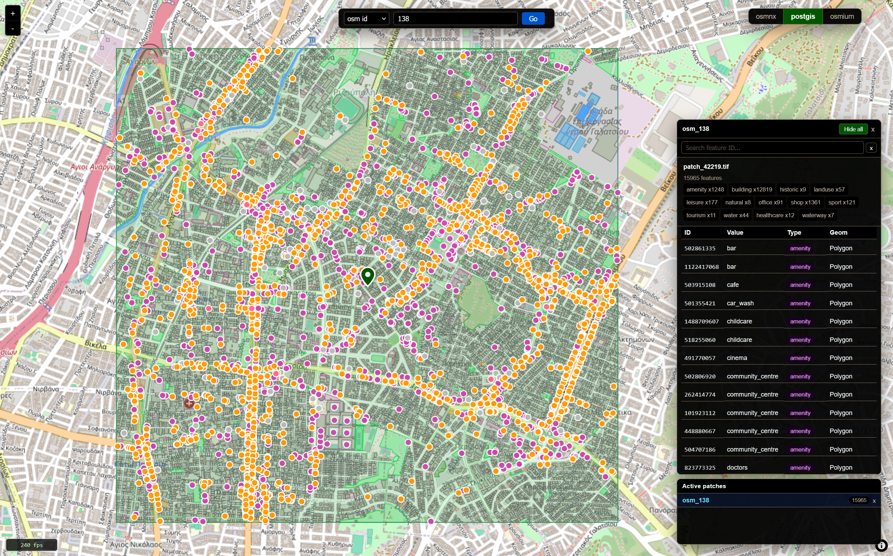
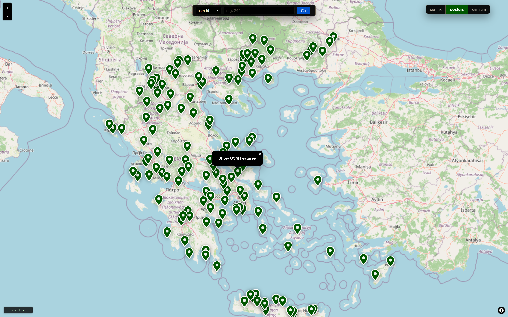
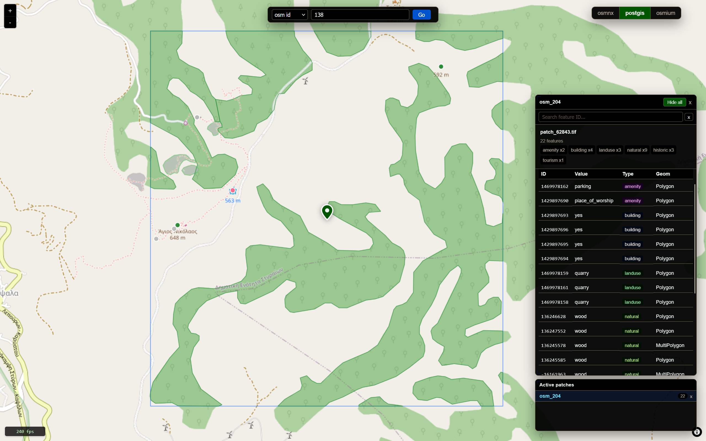
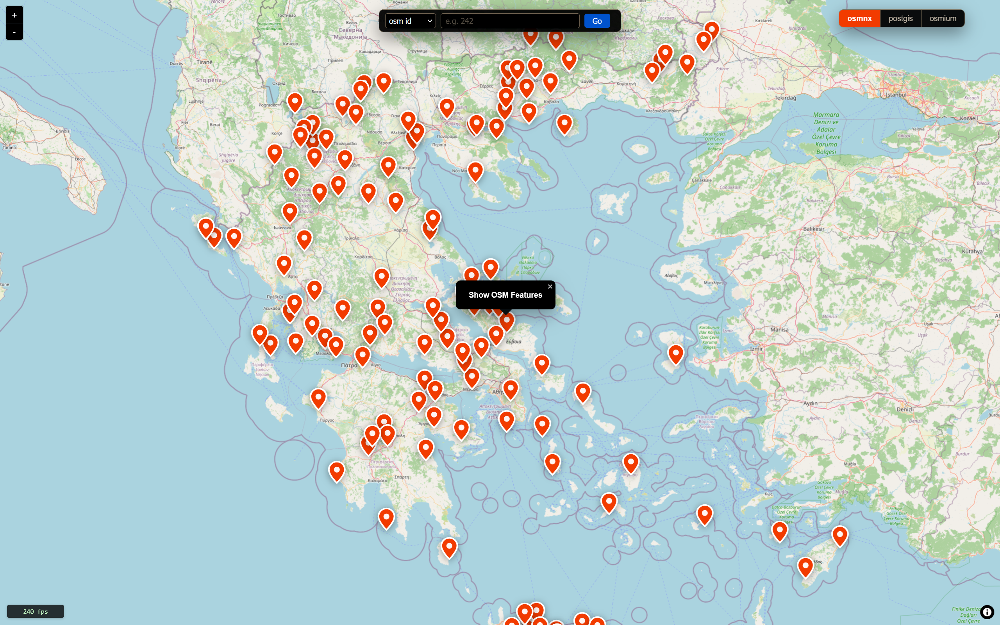

# OSM GeoJSON Backend Benchmark & Interactive Explorer

An individual geospatial engineering project for generating **patch-aligned OpenStreetMap GeoJSON**, comparing three extraction approaches, and visually inspecting their outputs in a custom high-performance map interface.

<p align="center">
  
</p>

## Project at a glance

| | |
|---|---|
| **Project type** | Individual project |
| **My role** | Research, geospatial pipeline design, backend implementation, comparison tooling, frontend interaction design, performance work |
| **Core problem** | Create consistent OSM GeoJSON for satellite-image patches and understand how different extraction backends affect the result |
| **Backends compared** | OSMnx / Overpass API, PostgreSQL + PostGIS + osm2pgsql, Osmium + local `.osm.pbf` |
| **Visualization** | Custom MapLibre GL interface with lazy patch loading, feature inspection, search, backend switching, animation, and responsive panels |
| **Main technologies** | Python, GeoPandas, Shapely, PyProj, OSMnx, PostGIS, osm2pgsql, Osmium, MapLibre GL JS, Turf.js, Web Workers, JavaScript |

---

## Demo

The short demo shows backend switching, map navigation, patch selection, OSM feature rendering, feature inspection, search, and the custom interaction flow.

<video
  src="https://github.com/user-attachments/assets/f3c10da3-40f1-4bc6-b438-a3c579553ae2"
  controls
  width="100%">
</video>

---

## Why I built this

I started this project while exploring geospatial representation-learning work and repositories such as **SatCLIP** and **GeoCLIP**. For my own experiments, I needed something more specific: a reproducible way to take geographic patch coordinates and create **OSM-derived GeoJSON aligned to each patch**.

I could not find an end-to-end workflow in the repositories I was studying that solved that exact problem. Instead of implementing one arbitrary downloader, I identified **three practical ways to obtain the GeoJSON data** and decided to compare them:

1. **OSMnx** — query OSM features through the Overpass API.
2. **PostGIS** — import a regional OSM PBF locally with `osm2pgsql`, then query spatially.
3. **Osmium** — extract directly from a local `.osm.pbf` and export GeoJSON with `osmium-tool`.

The project therefore became both a **data-generation pipeline** and a **comparison environment**. I wanted to examine not only setup and runtime trade-offs, but also whether the three approaches produced equivalent feature coverage and geometry interpretation for the same geographic patches.

---

## Research and design work

A major part of the project was deciding **what should count as a relevant OSM feature** and **how ambiguous closed ways should be interpreted**. Simply downloading everything would make backend comparisons noisy and would not match the feature vocabulary I wanted to work with.

### 1. Selecting meaningful OSM features

I researched related repositories and reused a reference vocabulary stored in `w2v_columns.csv`: https://github.com/srai-lab/hex2vec. The pipeline converts entries from that CSV into exact OSM `(key, value)` pairs and uses the same vocabulary across the three backends.

For example, the system does not merely keep every object with a `building` or `natural` key. It can restrict features to exact combinations represented by the reference vocabulary. This gave me a common filtering target for comparing otherwise very different extraction systems.

### 2. Polygon vs line interpretation

OSM geometry is not always semantically obvious from topology alone. A closed way can represent an area in one context and a linear feature in another.

To avoid inventing backend-specific heuristics, I researched and incorporated the `polygon-features.json`: https://github.com/tyrasd/osm-polygon-features ruleset used by **osm-polygon-features**. The rules distinguish:

- keys that are treated as polygons for **all** values,
- keys that use a **whitelist** of polygon values,
- keys that use a **blacklist** of non-polygon values.

I then adapted those rules to two different local pipelines:

- `load_postgis.py` generates an `osm2pgsql` Lua flex configuration that decides whether ways are inserted as polygons or lines;
- the Osmium path builds an export configuration with corresponding `area_tags` and `linear_tags`.

This was one of the most research-heavy parts of the repository because the goal was not just to make each backend run, but to make their outputs **meaningfully comparable**.

### 3. Consistent patch geometry

Each patch is treated as a **2.56 km × 2.56 km square** by default (`DIST = 1280 m` is the half-width).

To avoid treating longitude/latitude degrees as metres, `find_patch_bbox.py`:

1. selects the appropriate UTM zone from the patch coordinates;
2. projects the patch centre from WGS84 into UTM;
3. expands the centre by ±1280 metres;
4. transforms the resulting bounding box back to WGS84.

All three extraction backends therefore operate on the same metric patch extent.

---

## Part 1 — Creating and comparing GeoJSON

The extraction pipeline is implemented in `create_osm/`.

### Common workflow

For every row in `index_greece.csv`, the pipeline:

1. reads the patch filename and centre coordinates;
2. computes a metric patch-aligned bounding box;
3. extracts OSM features with the selected backend;
4. filters features against the shared exact `(key, value)` vocabulary;
5. clips geometry to the patch bounds where required;
6. creates a normalized `label` property such as:

```text
amenity:cafe;building:yes
```

7. writes both combined and geometry-specific GeoJSON files.

### The three backend strategies

| Backend | Access pattern | Main strength | Main trade-off |
|---|---|---|---|
| **OSMnx** | Remote Overpass API query | Minimal local OSM infrastructure | Network dependency and API/rate-limit considerations |
| **PostGIS** | Local spatial SQL over imported OSM data | Reusable database and direct spatial querying | Heavier setup and database storage |
| **Osmium** | Local PBF extraction + export | Offline workflow without a full database | Requires CLI tooling and careful export geometry rules |

I intentionally kept all three implementations in the same project because their differences are part of the experiment.

### Backend-specific implementation details

#### OSMnx

- queries a bounding box through `osmnx.features_from_bbox()`;
- requests the relevant OSM tag keys;
- clips results to the patch box;
- filters to exact reference `(key, value)` pairs;
- exports combined and geometry-specific files.

#### PostGIS

- imports the regional PBF through `osm2pgsql` flex output;
- auto-generates a Lua filter from the reference tag vocabulary;
- applies polygon/line decision rules during import;
- stores points, lines, and polygons in separate tables;
- uses `ST_Intersects`, `ST_Intersection`, `ST_MakeEnvelope`, and CRS transforms to query and clip each patch.

#### Osmium

- extracts a patch bounding box from a local PBF;
- generates Osmium area/linear export rules from `polygon-features.json`;
- exports point, line, and polygon geometry to temporary GeoJSON;
- applies the shared tag-pair filter;
- clips to the patch extent;
- writes normalized outputs.

### Quantitative comparison helper

`create_osm/count_tags.py` performs a second comparison pass over generated files. It reports:

- tag-key counts per backend;
- counts split by `Point`, `LineString`, and `Polygon`;
- selected value-level drill-downs;
- features missing normalized labels;
- geometry/tag count differences between backends.

This helped me detect where outputs diverged instead of relying only on visual inspection.

---

## Part 2 — Interactive visual comparison

The second half of the project is `visualize_osm/`: a custom map application built to inspect the extracted results directly on an Earth map and compare backends visually.

<p align="center">
  
</p>

I did not want a static plotting script. I focused on making the tool feel responsive enough to explore many patches and dense OSM feature collections interactively.

### Interaction features I implemented

- **Backend switcher** for OSMnx, PostGIS, and Osmium outputs.
- **Patch markers** showing where generated GeoJSON exists for the active backend.
- **Click-to-load patch overlays** rather than rendering every feature at startup.
- **Search bar** supporting patch IDs, feature IDs, and backend-specific OSM IDs.
- **Feature detail panel** with ID, value, tag type, and geometry type.
- **Per-tag summary badges** and group-level visibility controls.
- **Hide/show all features** for a selected patch.
- **Active patches panel** for tracking and removing loaded overlays.
- **Feature selection and map focus** with animated camera movement.
- **Resizable panels** with persisted panel dimensions.
- **Custom smooth zoom controls**, wheel zoom behaviour, and tuned drag inertia.
- **Live FPS counter** while interacting with the map.

### Performance work

Dense urban patches can contain many thousands of OSM features. I therefore spent time on rendering and UI performance rather than treating the visualizer as a simple demo.

The current implementation includes:

- lazy backend/patch metadata loading;
- per-patch GeoJSON requests;
- client-side feature caches;
- a **Web Worker** for feature preparation;
- chunked worker-to-main-thread feature transfer;
- virtualized feature-table rendering;
- selective MapLibre source updates;
- prepared-feature caches on the Python server;
- `lru_cache` reuse for loaded patch data;
- single-flight locking to avoid duplicate concurrent preparation of the same patch;
- animation based on `requestAnimationFrame` / MapLibre `easeTo` flows;
- custom smooth-step easing for zoom and feature focus.

The result is an interface where I can zoom, drag, switch backends, inspect individual features, and compare output differences without turning the visualization into a static screenshot pipeline.

---

## Screenshots

<table>
  <tr>
    <td width="50%">
      <br>
      <sub><b>Dense urban patch:</b> loaded overlays, tag summaries, searchable feature table, active patch management, and feature highlighting.</sub>
    </td>
    <td width="50%">
      <br>
      <sub><b>Rural patch:</b> polygon-heavy output used to inspect land-use and natural-feature geometry.</sub>
    </td>
  </tr>
  <tr>
    <td width="50%">
      <br>
      <sub><b>PostGIS overview:</b> Greece-wide patch availability for the active backend.</sub>
    </td>
    <td width="50%">
      <br>
      <sub><b>OSMnx overview:</b> backend switching makes coverage differences visible immediately.</sub>
    </td>
  </tr>
</table>

---

## My role and contributions

This was an **individual project**. I was responsible for the full process from research to implementation.

My main contributions were:

- identifying the missing patch-aligned OSM→GeoJSON workflow I needed for geospatial experiments;
- researching three alternative extraction approaches rather than committing to the first workable option;
- studying external tag vocabularies and geometry rules;
- implementing the OSMnx, PostGIS, and Osmium backend paths;
- creating a common filtering and labeling strategy across the backends;
- implementing metric patch bounding boxes with dynamic UTM-zone selection;
- generating `osm2pgsql` Lua rules programmatically;
- adapting polygon/linear rules for the Osmium export path;
- creating backend comparison utilities for tag and geometry coverage;
- designing and implementing the custom interactive map application;
- adding search, detail panels, filtering, backend controls, active-patch management, and feature navigation;
- optimizing the visualizer with lazy loading, worker-based preparation, virtualization, caching, and smooth interaction work.

---

## Challenges and learning outcomes

### Challenge 1 — “The same data” is not automatically the same output

OSMnx, PostGIS/osm2pgsql, and Osmium expose OSM data through different abstractions. Query behaviour, IDs, available properties, geometry conversion, and polygon interpretation can differ.

**What I did:** I introduced a common exact tag vocabulary, common patch bounds, common `label` output, geometry-aware comparison scripts, and explicit polygon/line rules.

**What I learned:** reproducibility in a data pipeline depends less on calling equivalent APIs and more on making hidden assumptions explicit.

### Challenge 2 — Area vs line semantics

A closed OSM way is not necessarily a polygon. Backend defaults can therefore create misleading comparisons.

**What I did:** I researched an established polygon-feature ruleset and translated its `all`, `whitelist`, and `blacklist` semantics into the PostGIS and Osmium workflows.

**What I learned:** geospatial preprocessing often contains domain semantics that cannot be recovered from geometry alone.

### Challenge 3 — Correct metric alignment

The patches are defined in metres, while OSM queries use WGS84 longitude/latitude.

**What I did:** I dynamically select a UTM zone, construct the patch extent in metres, and transform it back to WGS84 for extraction.

**What I learned:** coordinate-reference-system decisions are part of application correctness, not an implementation detail.

### Challenge 4 — Interactive exploration of dense feature data

Loading thousands of features into both a map and a detailed table can easily make the browser feel sluggish.

**What I did:** I added lazy loading, Web Worker preparation, chunked transfer, virtualized rows, selective source refreshes, server-side prepared caches, and explicit interaction tuning.

**What I learned:** high-performance interactive media requires coordinating data architecture, rendering, UI state, and animation—not just optimizing one loop.

## Architecture

```text
index.csv
   │
   ▼
filter_csv_for_greece.py
   │
   └──► index_greece.csv
             │
             ▼
       metric patch bbox
     (WGS84 → UTM → WGS84)
             │
      ┌──────┼────────┐
      ▼      ▼        ▼
   OSMnx  PostGIS   Osmium
      │      │        │
      └──────┼────────┘
             ▼
 shared relevant-tag vocabulary
 + polygon/linear semantics
             │
             ▼
 data/<backend>/osm_<id>/
   *_features.geojson
   *_point.geojson
   *_linestring.geojson
   *_polygon.geojson
             │
      ┌──────┴───────────┐
      ▼                  ▼
 count_tags.py     visualize_osm/
 quantitative       interactive
 comparison         comparison
```

---

## Repository structure

```text
.
├── create_osm/
│   ├── main.py                    # Iterate patches and run a selected backend
│   ├── download_osm.py            # OSMnx, PostGIS, and Osmium extraction logic
│   ├── filter_csv_for_greece.py   # Filter the source patch index to Greece
│   ├── find_patch_bbox.py         # Dynamic UTM metric bounding boxes
│   ├── load_postgis.py            # Build DB + generate osm2pgsql Lua flex rules
│   ├── load_postgis_old.py        # Earlier PostGIS import approach
│   └── count_tags.py              # Compare tag/geometry coverage
│
├── visualize_osm/
│   ├── main.py                    # Build + serve entry point
│   ├── config.py                  # Paths, discovered backends, shared colours
│   ├── app/
│   │   ├── main.py                # Build generated map page
│   │   ├── map_builder.py         # MapLibre shell and navigation behaviour
│   │   ├── data.py                # Patch/backend metadata
│   │   ├── ui_fragments.py        # Search, FPS, backend controls
│   │   ├── styles.py
│   │   ├── static/map.css
│   │   └── client/
│   │       ├── core.js
│   │       ├── feature_worker.js
│   │       ├── features_layers.js
│   │       ├── panels.js
│   │       ├── patches_markers.js
│   │       ├── search_boot.js
│   │       └── selection_interaction.js
│   ├── server/main.py             # Threaded static/API server + caches
│   └── patches_map.html           # Generated map page
│
├── data/                          # Generated backend outputs (git-ignored)
├── assets/                        # README screenshots and demo video
├── index.csv
├── index_greece.csv
├── w2v_columns.csv                # Reference exact tag vocabulary
├── polygon-features.json          # Polygon/line decision rules
├── osm_filter.lua                 # Generated osm2pgsql filter
├── greece.poly
├── greece_boundary.geojson
└── requirements.txt
```

---

## Setup

### 1. Install Python dependencies

```bash
python -m venv .venv
source .venv/bin/activate      # Linux/macOS
# .venv\Scripts\activate       # Windows PowerShell

pip install -r requirements.txt
```

### 2. Install backend-specific system tools

For Osmium:

```bash
# Ubuntu / Debian
sudo apt install osmium-tool

# macOS
brew install osmium-tool
```

For PostGIS:

```bash
# Ubuntu / Debian
sudo apt install postgresql postgis osm2pgsql
```

The current PostGIS scripts use these defaults:

```text
Database: osm_db
User:     postgres
Password: postgres
Host:     localhost
```

Change `DSN` / database constants in the source if your local setup differs.

### 3. Prepare the patch index

`filter_csv_for_greece.py` expects `index.csv` in the repository root and writes `index_greece.csv`.

```bash
python create_osm/filter_csv_for_greece.py
```

The script uses the Greece boundary files and can download `greece.poly` from Geofabrik when it is missing.

### 4. Download a Greece OSM PBF

Place a file matching this pattern in the repository root:

```text
greece-*.osm.pbf
```

For example, use the Greece extract from Geofabrik.

---

## Running the GeoJSON pipeline

### OSMnx

```bash
python create_osm/main.py --backend osmnx
```

### PostGIS

First import the PBF and generate the filtered database:

```bash
python create_osm/load_postgis.py
```

Then extract patch GeoJSON:

```bash
python create_osm/main.py --backend postgis
```

### Osmium

```bash
python create_osm/main.py --backend osmium
```

### Output format

For patch index `i`, files are written under:

```text
data/<backend>/osm_<i>/
```

Typical output:

```text
<patch_stem>_features.geojson
<patch_stem>_point.geojson
<patch_stem>_linestring.geojson
<patch_stem>_polygon.geojson
```

The combined `*_features.geojson` files are what the interactive visualizer serves.

---

## Running the visualizer

At least one generated backend directory must exist under `data/`.

Build the map and start the server:

```bash
python visualize_osm/main.py
```

Open:

```text
http://localhost:8001/
```

Build only:

```bash
python visualize_osm/main.py --build
```

Serve an already generated map:

```bash
python visualize_osm/main.py --serve
```

Custom port:

```bash
python visualize_osm/main.py --serve --port 9000
```

The standalone server entry point is also available:

```bash
python visualize_osm/server/main.py
```

Its own default port is `8000`.

---

## Comparing backend outputs

After generating files for two or more backends:

```bash
python create_osm/count_tags.py
```

Use this together with the backend toggle in the visualizer: the script exposes count-level differences, while the map makes spatial and geometry differences easier to inspect.

---

## Current implementation notes

- The visualizer discovers available backends from subdirectories of `data/`; it therefore expects at least one generated backend directory.
- `data/` is intentionally git-ignored because generated GeoJSON can become large.
- The map shell loads MapLibre GL JS and Turf.js from CDNs and uses OpenStreetMap raster tiles, so the visualization itself is not fully offline.
- In the supplied source archive, `polygon-features.json` is stored at the repository root, while the current Osmium extraction method resolves it relative to `create_osm/download_osm.py`. Before running that backend, either copy the ruleset into `create_osm/` or change that lookup to use the repository-root path. I have documented this rather than hiding the mismatch.

---

## References and acknowledgements

This project builds on open geospatial tooling and reference data rather than presenting the underlying OSM ecosystem as my own work.

- **OpenStreetMap** — source geospatial data and map tiles.
- **Geofabrik** — regional `.osm.pbf` and boundary downloads.
- **OSMnx** — Python access to OSM data.
- **PostGIS / PostgreSQL / osm2pgsql** — local spatial database workflow.
- **Osmium Tool** — local OSM extraction and export.
- **MapLibre GL JS** — interactive map rendering.
- **Turf.js** — browser-side geospatial utilities.
- **hex2vec reference vocabulary** — source context for `w2v_columns.csv`: https://github.com/srai-lab/hex2vec
- **osm-polygon-features** — polygon/linear ruleset: https://github.com/tyrasd/osm-polygon-features

The research, pipeline integration, backend comparison, normalization strategy, interactive application, and performance work in this repository were implemented by me.
